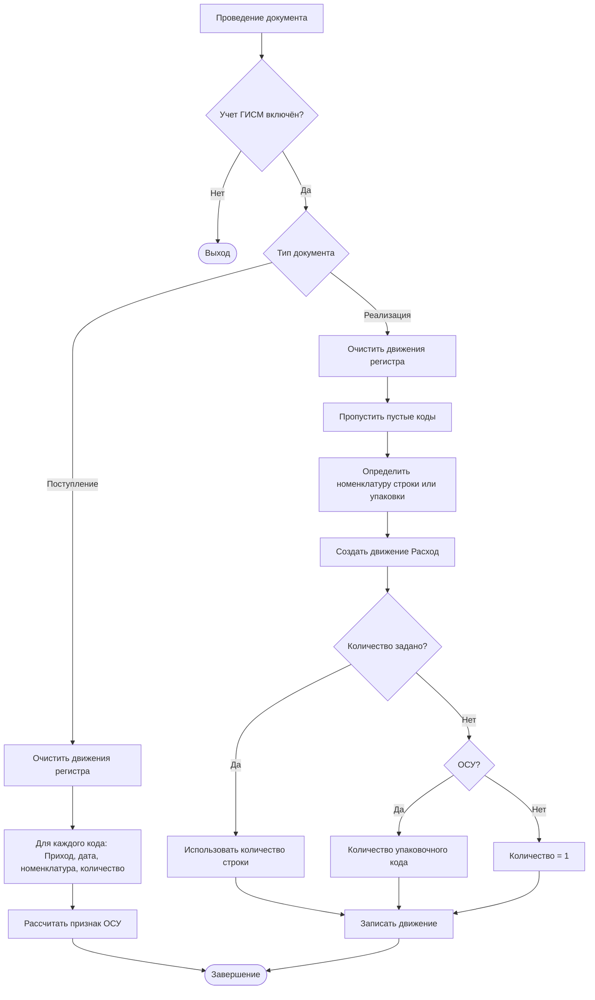

# Технический отчёт по доработке расширения «Честный знак»

**Дата анализа:** 08.10.2026  
**Репозиторий:** `pirato4ka/CHestniyZnak`  
**Ветка первой доработки:** `arena/dd203b2c-chestniyznak`  
**Ветка текущей доработки:** `arena/4097c385-chestniyznak`  
**Исходная точка:** `addb8a0` — `chestniy znak v1`  
**Точка отчёта:** `5a19e20` — merge готового решения (состояние кода до доработки 08.10.2026)

> **Внимание.** Разделы 4, 8, 9 и 10 описывают состояние кода на точке `5a19e20`. Актуальная
> реализация (FIFO-списание ОСУ в разрезе «Номенклатура + GTIN», физический сброс движений и
> управляемые блокировки при повторном проведении, запрет частичного подбора, сообщения по
> стандарту 1С:ИТС) описана в `docs/ОписаниеИзменений_УчетОстатковИСМП.md`; краткая сводка — в
> разделе 12 ниже.

> В отчёте ОСУ расшифровывается как объёмно-сортовой учёт. В пользовательском запросе также употреблено «гтин»; в коде используется термин `GTIN`/«ГТИН».

## 1. Резюме

В расширении реализован механизм автоматического подбора кодов маркировки для документа **«Реализация товаров и услуг»** из остатков регистра `БНС_ОстаткиИСМП`, а также проведение приходов и расходов по этому регистру. Основной подбор разделён на два режима:

1. **ОСУ / групповая маркировка** — формируется один GS1-128 для строки товара, содержащий `(02)GTIN(37)Количество`.
2. **Поэкземплярная маркировка** — выбираются первые доступные уникальные коды, по одному коду на единицу товара.

В формы документов добавлены команды заполнения и очистки кодов. Для пакетной обработки документов сохранена единая серверная логика общего модуля. Добавлены проверки количества, GTIN, принадлежности штрихкода номенклатуре, дефицита остатков и сообщения о частичном заполнении.

## 2. История изменений от исходника до текущей версии

| Коммит | Содержание | Результат |
|---|---|---|
| `addb8a0` | `chestniy znak v1` | Исходная конфигурация и базовая подсистема ГИСМ |
| `5bf377f` | «Реализовать подбор маркировки ОСУ и поэкземплярно (#1)» | Первая реализация автоподбора двух режимов, движений регистра и команд форм |
| `03b9b37` | `commit` | Промежуточная фиксация |
| `3bd744c` | Merge | Сведение веток разработки |
| `1fb892a` | «Доработка автоподбора кодов маркировки ОСУ и штучный учет по ТЗ (#2)» | Уточнение списания, GTIN, ОСУ, обработки ошибок и массового заполнения |
| `5a19e20` | Merge текущего решения | Итоговое состояние репозитория |

Итоговая разница `addb8a0..5a19e20`: **4 изменённых программных модуля, 556 добавленных строк и 238 удалённых строк**. Изменения не затрагивают структуру метаданных в рамках последней доработки; основной объём находится в BSL-модулях.

## 3. Затронутые объекты

| Объект | Назначение |
|---|---|
| `CommonModules/БНС_ОбщегоНазначенияГИСМ/Ext/Module.bsl` | Единая серверная логика движений, получения остатков, подбора, GTIN и статусов |
| `Documents/РеализацияТоваровУслуг/Forms/ФормаДокументаОбщая/Ext/Form/Module.bsl` | Команды в форме реализации, заполнение маркировки текущего документа |
| `Documents/РеализацияТоваровУслуг/Forms/ФормаДокументаТовары/Ext/Form/Module.bsl` | Команды на форме товаров и очистка/пересчёт табличной части |
| `DataProcessors/БНС_ЗаполнениеМаркировкиДокументыОтгрузки/Forms/Форма/Ext/Form/Module.bsl` | Массовое заполнение и очистка маркировки в документах отгрузки |
| `InformationRegisters/ОписаниеGTINИС.xml` | Регистр сведений, предназначенный для описания GTIN номенклатуры |
| `AccumulationRegisters/БНС_ОстаткиИСМП.xml` | Регистр накопления остатков маркировки |
| `EventSubscriptions/БНС_ПроведениеДокументовГИСМ.xml` | Подписка, связывающая проведение документов с движениями ГИСМ |

## 4. Архитектура и основные применённые механизмы

### 4.1. Клиент–серверное разделение

Клиентская часть формы только запрашивает подтверждение, вызывает сервер и показывает уведомление. Запросы, чтение остатков, создание элементов справочника и изменение объекта выполняются на сервере. Это снижает риск расхождения данных и не выносит бизнес-логику в интерфейс.

Типовой контур:

```bsl
РезультатЗаполнения = БНС_ОбщегоНазначенияГИСМ.ЗаполнитьМаркировкуРеализации(Объект);
Модифицированность = Истина;
ПоказатьОповещениеПользователя(..., РезультатЗаполнения.Сообщение, ...);
```

### 4.2. Остатки и движения

- поступление маркировки создаёт движение **Приход**;
- реализация создаёт движение **Расход**;
- перед формированием движений регистр очищается и заполняется заново по текущей табличной части документа;
- для ОСУ количество берётся из поля строки маркировки, затем из упаковочного штрихкода;
- для поэкземплярного кода количество по умолчанию равно `1`;
- флаг `ОбъемноСортовойУчет` определяется по описанию номенклатуры, а не по типу упаковки.

### 4.3. Подготовка данных подбора

`ПолучитьСвободнуюМаркировку()` возвращает структуру из двух таблиц значений:

- `ТзнОбщий`: номенклатура, требуемое количество, общий остаток;
- `ТзнКоды`: номенклатура, код упаковки, остаток, признак ОСУ и количество.

Остатки запрашиваются на границе **до момента документа** (`ВидГраницы.Исключая`). Это задумано для повторного заполнения уже проведённой реализации без учёта её собственного расхода.

### 4.4. Алгоритм ОСУ

Для ОСУ код строится как `(02)` + валидированный GTIN-14 + `(37)` + целое количество. Затем в справочнике `ШтрихкодыУпаковокТоваров` выполняется поиск по наименованию или значению штрихкода. Если запись существует для другой номенклатуры — операция отклоняется. Если записи нет — создаётся монотоварная упаковка типа `GS1_128`.

Фрагмент реализованной логики:

```bsl
СтрокаКодаОСУ = "(02)" + GTIN14 + "(37)" + Формат(КоличествоТовара, "ЧГ=0");
ШтрихкодОСУ = НайтиИлиСоздатьШтрихкодОСУ(
    СтрокаКодаОСУ, СтрТовара.Номенклатура, КоличествоТовара, ТекстОшибки);
```

В документ добавляется **одна** строка маркировки на строку товара, а количество не заменяется на единицу.

### 4.5. Алгоритм поэкземплярного учёта

Для номенклатуры, не относящейся к ОСУ, перебираются свободные строки `ТзнКоды`. Берутся только строки с остатком не менее единицы и непустым кодом. На каждый экземпляр создаётся строка маркировки с количеством `1`, после выбора остаток строки обнуляется в локальной таблице, что исключает повторный выбор одного кода в рамках текущего заполнения.

### 4.6. Поиск и проверка GTIN

Порядок источников:

1. регистр `ОписаниеGTINИС`;
2. справочник `ШтрихкодыУпаковокТоваров` по номенклатуре.

Поиск поля регистра сделан адаптивным: проверяются имена `GTIN`, `ГТИН`, `ЗначениеGTIN`, `КодGTIN`, `ЗначениеШтрихкода`, `Штрихкод`. Далее `НормализоватьGTIN14()`:

- извлекает GTIN после AI `(01)` или после префикса `01` без скобок;
- принимает длины 8, 12, 13 и 14 цифр;
- проверяет, что значение состоит только из цифр;
- проверяет контрольную цифру;
- дополняет код слева нулями до 14 знаков.

### 4.7. Обработка ошибок и статусов

Функция заполнения возвращает структуру:

```bsl
Недозаполнено       // Булево
КоличествоЗаписей   // Число
Сообщение            // Строка с объединёнными сообщениями
```

Поддержаны случаи: незаписанный документ, отсутствие маркируемой номенклатуры, дробное количество, отсутствие валидного GTIN, конфликт штрихкода, недостаток свободных марок и ошибка записи справочника. После заполнения вызывается штатный пересчёт статусов серий/маркировки.

## 5. Диаграмма деятельности: общий механизм проверки и заполнения

```mermaid
flowchart TD
    A([Старт]) --> B[Пользователь нажимает «Заполнить коды маркировки»]
    B --> C{Документ изменён?}
    C -- Да --> D[Записать документ]
    C -- Нет --> E[Показать подтверждение]
    D --> E
    E --> F{Подтверждено?}
    F -- Нет --> Z([Завершение без изменений])
    F -- Да --> G{Документ записан?}
    G -- Нет --> H[Вернуть ошибку: сначала записать документ]
    H --> I[Показать результат]
    G -- Да --> J[Получить остатки до момента документа]
    J --> K[Очистить табличную часть кодов]
    K --> L[Перебрать строки товаров]
    L --> M{Номенклатура маркируемая?}
    M -- Нет --> N[Пропустить строку]
    M -- Да --> O{Количество целое и больше нуля?}
    O -- Нет --> P[Отметить недозаполнение и добавить сообщение]
    O -- Да --> Q{ОСУ?}
    Q -- Да --> R[Получить и проверить GTIN]
    R --> S{GTIN валиден?}
    S -- Нет --> T[Ошибка строки: GTIN не найден]
    S -- Да --> U[Сформировать (02)GTIN(37)Количество]
    U --> V[Найти или создать GS1-128]
    V --> W[Добавить одну строку маркировки]
    Q -- Нет --> X[Выбрать первые свободные уникальные коды]
    X --> Y{Кодов достаточно?}
    Y -- Нет --> AA[Добавить доступные коды и сообщение о дефиците]
    Y -- Да --> AB[Добавить N строк по одной на экземпляр]
    N --> AC{Есть ещё строки?}
    P --> AC
    T --> AC
    W --> AC
    AA --> AC
    AB --> AC
    AC -- Да --> L
    AC -- Нет --> AD[Пересчитать статусы маркировки]
    AD --> AE[Вернуть структуру результата]
    AE --> I[Показать уведомление]
    I --> AF([Конец])
```

## 6. Блок-схема проверки ОСУ и GTIN

```mermaid
flowchart LR
    A[Строка товара] --> B{Вид продукции использует ОСУ?}
    B -- Нет --> C[Поштучный подбор из остатков]
    B -- Да --> D[Запрос GTIN из ОписаниеGTINИС]
    D --> E{Найден?}
    E -- Нет --> F[Поиск штрихкода номенклатуры]
    F --> G[Нормализация GTIN]
    E -- Да --> G
    G --> H{Длина 8/12/13/14 и только цифры?}
    H -- Нет --> I[Отклонить: невалидный GTIN]
    H -- Да --> J[Проверить контрольную цифру]
    J --> K{Контрольная цифра верна?}
    K -- Нет --> I
    K -- Да --> L[Дополнить слева до GTIN-14]
    L --> M[Сформировать (02)GTIN14(37)Количество]
    M --> N{Код уже есть?}
    N -- Нет --> O[Создать упаковку GS1-128, монотоварная]
    N -- Да --> P{Номенклатура совпадает?}
    P -- Нет --> Q[Отклонить: конфликт владельца]
    P -- Да --> R[Обновить количество упаковки]
    O --> S[Добавить одну строку в документ]
    R --> S
    S --> T[Количество ОСУ сохраняется полностью]
```

## 7. Блок-схема движений при проведении



## 8. Что именно исправлялось по смыслу ТЗ

1. Убран жёстко зашитый отбор номенклатуры по коду `БП-00013022`; подбор переведён на номенклатуру текущего документа и регистр описания.
2. Добавлена поддержка двух режимов: ОСУ и поэкземплярного учёта.
3. Исправлено списание: поэкземплярный код расходуется как `1`, ОСУ — как полное количество группы.
4. Добавлено определение ОСУ через описание вида продукции ГИСМ.
5. Добавлены нормализация GTIN-14 и контрольная цифра.
6. Добавлено создание/переиспользование группового штрихкода.
7. Исключено повторное использование одной свободной марки в одном заполнении.
8. Добавлены частичный результат и понятные сообщения вместо безусловного прерывания массовой обработки.
9. Добавлен пересчёт штатных статусов после изменения табличной части.
10. В формы добавлены команды подтверждённого заполнения и очистки.
11. При массовой обработке ошибка одного документа сообщается, но не должна останавливать обработку остальных документов.

## 9. Результаты ревью текущего кода и риски

Ниже приведены наблюдения именно по состоянию `5a19e20`; это важно проверить в конфигураторе 1С перед эксплуатацией.

### 9.1. Критическая проверка `ПолучитьСвободнуюМаркировку`

В текущем тексте запроса присутствует условие:

```bsl
РеализацияТоваровУслугТовары.Номенклатура = &Номенклатура
```

но параметр `Номенклатура` в функции не устанавливается. Одновременно таблица `ТзнОбщий` создаётся пустой и не заполняется результатом отдельного запроса. Это может привести к ошибке выполнения запроса либо к результату «маркируемые строки не найдены», даже когда остатки существуют.

**Рекомендация:** либо удалить лишний отбор `&Номенклатура` и вернуть пакетный запрос с заполнением `ТзнОбщий`, либо явно установить параметр и формировать общую таблицу для каждой номенклатуры. Это должно быть покрыто тестом на ОСУ и на поэкземплярный товар.

**Статус:** устранено в доработке от 08.10.2026 — отбор `&Номенклатура` в запросе отсутствует, `ТзнОбщий` заполняется пакетным запросом (см. раздел 12 и `docs/ОписаниеИзменений_УчетОстатковИСМП.md`).

### 9.2. Контроль структуры регистра GTIN

Адаптивный перебор имён полей полезен для разных конфигураций, но исключения подавляются. При поставке нужно зафиксировать фактическую структуру `ОписаниеGTINИС` и добавить диагностическое сообщение, если ни одно поле GTIN не найдено.

### 9.3. Транзакционная целостность

Создание/изменение группового штрихкода и изменение документа выполняются последовательно. Для массового режима желательно определить границы транзакции и правила отката, чтобы не получить созданный штрихкод без успешно записанного документа.

### 9.4. Конкурентный подбор

Два параллельных пользователя могут выбрать один и тот же свободный поэкземплярный код до записи движений. Нужны регламент тестирования конкурентного проведения и контроль отрицательных остатков/конфликта при записи.

### 9.5. Производительность

В цикле по строкам выполняются `НайтиСтроки`, вызов определения ОСУ и потенциальные запросы GTIN. Для больших документов рекомендуется кэшировать признак ОСУ и GTIN по номенклатуре.

## 10. План проверки готового решения

| Сценарий | Ожидаемый результат |
|---|---|
| Заполнить незаписанный документ | Сообщение «сначала запишите документ», табличная часть не изменена |
| ОСУ, валидный GTIN, количество 10 | Одна строка GS1-128 с `(02)GTIN(37)10` |
| ОСУ, отсутствующий GTIN | Строка отмечена как недозаполненная, код не создаётся |
| ОСУ, неверная контрольная цифра | GTIN отклонён |
| Существующий код другого товара | Конфликт не допускается |
| Поэкземплярный товар, остаток N >= требуемого | Создано N уникальных строк, в каждой количество 1 |
| Поэкземплярный товар, дефицит | Заполнено доступное количество, установлен признак недозаполнения |
| Повторное заполнение проведённой реализации | Собственный расход не блокирует подбор до момента документа |
| Проведение поступления | Приходные движения по каждому коду |
| Проведение реализации ОСУ | Расход полным количеством группы |
| Проведение реализации по экземплярам | Отдельный расход по 1 на код |
| Массовая обработка | Ошибка одного документа не прекращает обработку остальных |

## 11. Вывод

По истории Git реализована содержательная доработка от базовой версии до решения с двумя сценариями маркировки, серверным подбором из остатков, валидацией GTIN, движениями ГИСМ, командами форм и обработкой частичных результатов. Архитектурно наиболее важен общий модуль `БНС_ОбщегоНазначенияГИСМ`, поскольку через него должны работать и форма документа, и массовая обработка.

При этом текущий снимок репозитория необходимо прогнать в 1С на минимальном наборе сценариев из раздела 10. В частности, до выдачи решения в промышленную эксплуатацию требуется устранить/проверить несогласованность в `ПолучитьСвободнуюМаркировку()` с параметром `&Номенклатура` и заполнением `ТзнОбщий`. В отчёте это отмечено как результат технического аудита, а не как предположение о бизнес-требовании.

## 12. Доработка от 08.10.2026: учёт остатков ИС МП, ОСУ, проведение и сообщения

Полное описание доработки — `docs/ОписаниеИзменений_УчетОстатковИСМП.md`. Кратко:

1. **FIFO-списание ОСУ в разрезе «Номенклатура + GTIN».** Расход не привязывается к штрихкоду из
   документа: списание идёт по фактическим остаткам регистра `БНС_ОстаткиИСМП`, GTIN извлекается
   из `(01)`/`(02)`; остаток по записи штрихкода уменьшается (частичное списание 10 из 27
   допускается), несколько входящих штрихкодов одного GTIN распределяются между собой.
2. **Повторное проведение.** Перед расчётом остатков старые движения документа физически
   сбрасываются (`Движения.БНС_ОстаткиИСМП.Записывать = Истина; Очистить(); Записать();`),
   остатки читаются на `МоментВремени()` с границей `ВидГраницы.Исключая`, перед чтением
   устанавливается управляемая блокировка `БлокировкаДанных` по измерению `Номенклатура`.
3. **Признак `ОбъемноСортовойУчет`.** `(02)…(37)…` либо упаковка «Монотоварная упаковка» ⇒ Истина;
   `(01)…(21)…` ⇒ Ложь; иначе — по настройкам товарной категории (вида продукции ГИСМТ) на дату
   документа. Результат кэшируется в пределах одного проведения.
4. **Нехватка кодов.** Частичный подбор запрещён: при `Остаток < ТребуемоеКоличество` коды по
   строке не подбираются, частично подобранные удаляются, индикаторы маркировки строк
   сбрасываются; проведение документа не блокируется, по немаркированной строке движения не
   формируются.
5. **Сообщения по стандарту 1С:ИТС.** Одно сообщение на строку с привязкой к ячейке
   (`ОбщегоНазначенияКлиентСервер.СообщитьПользователю(Текст, , "Объект.Товары[N].Количество", , Ложь)`),
   без блокировки и без дублей; итоговое оповещение о результате команды — одно.

Изменены четыре модуля: общий модуль `БНС_ОбщегоНазначенияГИСМ`, модули двух форм документа
«Реализация товаров и услуг» и модуль формы обработки `БНС_ЗаполнениеМаркировкиДокументыОтгрузки`.
Метаданные расширения не изменялись.

Проверка (критерии приёмки ТЗ) — раздел 8 документа `docs/ОписаниеИзменений_УчетОстатковИСМП.md`:
повторное проведение 10 → 15 шт (ровно −15), схлопывание ОСУ `(02)GTIN(37)27` − 10 = +17,
дефицит кодов 1000/54 (коды по строке не подбираются, документ проводится без блокирующих ошибок).
